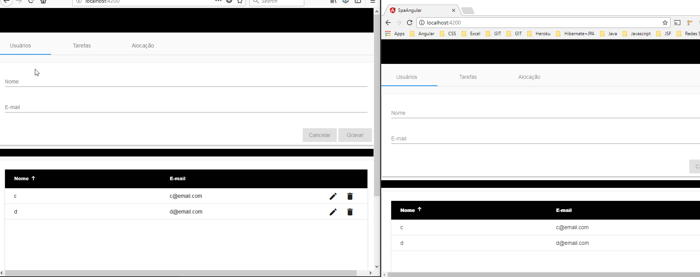

## O serviço de de mensageria

O serviço de mensageria foi aqui implementado com:
- a bibliteca `stomp.js`, do javascript, do lado do cliente Angular
- o pacote `spring-boot-starter-websocket` do springboot

O efeito esperado para essa implementação simples pode ser visto abaixo. Note que temos duas
janelas abertas para o navegador. Todas as ações executadas em uma delas está sendo automaticamente
detectada pela janela vizinha. Isso está sendo feito porque temos um serviço de mensageria
sendo monitorado pelo cliente.

### spring-boot-starter-websocket

O pacote do spring boot oferece uma API que permite a troca de informações entre Serviços (java) e Clientes (javascript/java). Você pode encontrar informações sobre o uso do pacote em várias fontes da internet:
- [Exemplo de projeto do site do spring](https://spring.io/guides/gs/messaging-stomp-websocket/)
- [Documentação oficial](https://docs.spring.io/spring/docs/5.0.2.RELEASE/spring-framework-reference/web.html#websocket)
- [Exemplo de uso com Angular](https://medium.com/oril/spring-boot-websockets-angular-5-f2f4b1c14cee)

